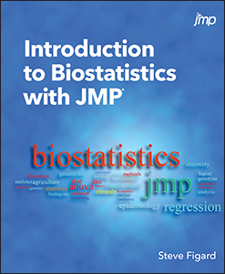

# Introduction to Biostatistics with JMP
by Dr. Steve Figard

# Project Title 
This repository contains sample data sets for the book <i>Introduction to Biostatistics with JMP</i>. Data files are JMP data sets.

## Description
Explore biostatistics using JMP in this refreshing introduction.

Presented in an easy-to-understand way, <i>Introduction to Biostatistics with JMP</i> introduces undergraduate students in the biological sciences to the most commonly used (and misused) statistical methods that they will need to analyze their experimental data using JMP. It covers many of the basic topics in statistics using biological examples for exercises so that the student biologists can see the relevance to future work in the problems addressed.

The book starts by teaching students how to become confident in executing the right analysis by thinking like a statistician then moves into the application of specific tests. Using the powerful capabilities of JMP, the book addresses problems requiring analysis by chi-square tests, t tests, ANOVA analysis, various regression models, DOE, and survival analysis. Topics of particular interest to the biological or health science field include odds ratios, relative risk, and survival analysis.

The author uses an engaging, conversational tone to explain concepts and keep readers interested in learning more. The book aims to create bioscientists who can competently incorporate statistics into their investigative toolkits to solve biological research questions as they arise.

*Epub* ISBN: 978-1-63526-718-1 
*Kindle* ISBN: 978-1-63526-719-8 
*PDF* ISBN: 978-1-63526-720-4 
*Paperback* ISBN: 978-1-62960-633-0 
*Hardback* ISBN: 978-1-64295-456-2 

<a href="https://www.sas.com/storefront/aux/en/spjmpbiostatintro/69798_excerpt.pdf">Table of Contents and Book Excerpt</a>

<a href="https://support.sas.com/en/books/authors/steve-figard.html">About the Author</a>

## License
This project is licensed under the [Apache 2.0 License](./LICENSE).
